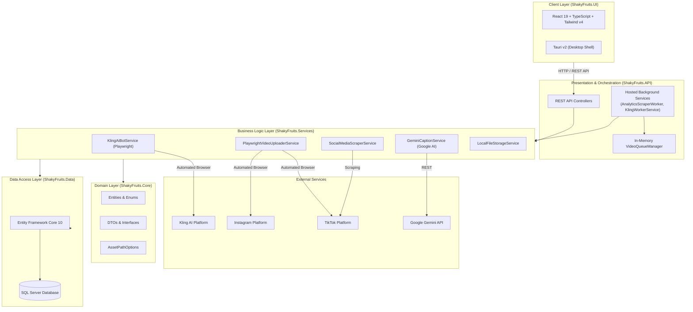

# Social Media Command Center

[](https://dotnet.microsoft.com/)
[](https://learn.microsoft.com/en-us/dotnet/csharp/)
[](https://react.dev/)
[](https://www.typescriptlang.org/)
[](https://v2.tauri.app/)
[](https://tailwindcss.com/)
[](https://playwright.dev/)
[](https://ai.google.dev/)
[](https://www.microsoft.com/en-us/sql-server)

An end-to-end, automated Social Media Command Center and Generative AI pipeline engineered for the **ShakyFruits** viral brand. The system orchestrates character motion transfer (via Kling AI), intelligent prompt pairing, Gemini AI copywriting, automated cross-platform publishing (TikTok & Instagram), real-time viral trend discovery, and performance analytics within an **N-Layer Clean Architecture**.

---

## 📑 Table of Contents

- [Overview](#-overview)
- [Key Features](#-key-features)
- [System Architecture](#-system-architecture)
- [Tech Stack](#-tech-stack)
- [Repository Structure](#-repository-structure)
- [Prerequisites](#-prerequisites)
- [Installation & Setup](#-installation--setup)
  - [1. Backend (.NET 10 API)](#1-backend-net-10-api)
  - [2. Playwright Browser Provisioning](#2-playwright-browser-provisioning)
  - [3. Frontend / Desktop (React 19 & Tauri v2)](#3-frontend--desktop-react-19--tauri-v2)
- [Configuration Reference](#-configuration-reference)
- [Bot Authentication & Browser Profiles](#-bot-authentication--browser-profiles)
- [API Endpoints Overview](#-api-endpoints-overview)
- [License](#-license)

---

## 💡 Overview

**ShakyFruits** is a high-volume social media brand featuring animated dancing fruit characters. Producing consistent daily content across multiple platforms requires synchronized character asset management, motion generation, viral audio pairing, copy generation, and performance tracking.

This dashboard eliminates manual friction by providing:
1. **Autonomous Video Generation**: Automates the upload of fruit character sprites and dance reference videos into Kling AI via Playwright bots, calculating credit costs and queueing rendering jobs.
2. **AI-Driven Strategy**: Continuously scrapes TikTok Creative Center for trending sounds and hashtags, using Google Gemini to draft viral hook captions.
3. **Zero-Touch Publishing**: Posts rendered videos directly to TikTok and Instagram with custom covers and hashtags.
4. **Synergy Analytics**: Tracks account growth and performs combinatorial analysis to identify which fruit characters or group combinations deliver the highest engagement.

---

## ✨ Key Features

### 🤖 Autonomous Kling AI Bot
- **Headless Browser Execution**: Uses Microsoft Playwright with Chromium to simulate human interaction on Kling AI.
- **Anti-Bot Defense**: Utilizes stealth user-agents, randomized event delays, and persistent session profiles to avoid Cloudflare challenges.
- **Dynamic Prompt Engine**: Injects character-specific prompts and multi-fruit rules (e.g., solo dance vs. group dance prompts) automatically.
- **Credit Quota Guardian**: Reads current generation cost before execution and caches available platform credits.

### ✍️ Google Gemini AI Copywriting
- Automatically analyzes character and music context to produce platform-ready captions.
- Dynamically attaches relevant, trending hashtags and engagement-provoking hooks.

### 🚀 Automated Social Publishing
- Autonomous upload workers for **TikTok** and **Instagram**.
- Configures video captions, auto-tags, and uploads custom video covers without human intervention.

### 📈 Trend Discovery & Competitive Intelligence
- Background scraper monitoring TikTok Creative Center for breakout audio tracks, viral hashtags, and dancing trends.
- In-memory caching (`tiktok_trends_cache.json`) for instant dashboard querying without rate limits.

### 📊 Deep Performance Analytics & Character Synergy
- Tracks historical views, likes, shares, comments, and follower gains over time.
- **Character Combinations & Synergy Matrix**: Compares solo fruit performances against multi-fruit ensemble clips to evaluate content ROI.
- **Golden Hours Heatmap**: Calculates optimal posting windows based on audience engagement data.

### 🖥️ Modern Desktop & Web UI
- Built with **React 19**, **TypeScript**, **Tailwind CSS v4**, and **shadcn/ui**.
- Supports running both as a blazing-fast web app (via Vite) and as a native desktop application (via **Tauri v2**).
- Interactive charts powered by **Recharts**.

---

## 🏗️ System Architecture

The solution adheres to **N-Layer Clean Architecture** principles, maintaining strict separation of concerns:



### Layer Breakdown
- **`ShakyFruits.API`**: Exposes RESTful endpoints, configures CORS, initializes Swagger OpenAPI documentation, and hosts background workers.
- **`ShakyFruits.Core`**: Houses business entities (`FruitAsset`, `ReferenceVideo`, `VideoGeneration`, `DailyTrend`, `PublishedVideo`, `VideoAnalytics`), Enums, interfaces, and DTOs.
- **`ShakyFruits.Data`**: Implements EF Core with SQL Server, manages migrations, entity configurations, and automatic timestamp audits.
- **`ShakyFruits.Services`**: Implements core automation engines: browser bots, caption generators, scrapers, and file management.
- **`ShakyFruits.UI`**: Modern UI dashboard with tabs for Dashboard, Assets, Generation Pipeline, Strategy, and Analytics.

---

## 💻 Tech Stack

| Domain | Technology | Details |
|---|---|---|
| **Backend Framework** | .NET 10 / ASP.NET Core | High-performance Web API |
| **Language** | C# 14 / TypeScript | Strict type safety across full stack |
| **ORM & Database** | Entity Framework Core 10 | Microsoft SQL Server (Code-First) |
| **Browser Automation** | Microsoft Playwright (.NET) | Headless Chromium automation & Anti-Bot bypass |
| **Generative AI** | Google Gemini API | Automated creative social caption generation |
| **Background Processing** | ASP.NET Hosted Services & Hangfire | Asynchronous task queues and scheduled scrapers |
| **Frontend Framework** | React 19 + Vite 7 | Modern reactive component hierarchy |
| **Desktop Wrapper** | Tauri v2 | Lightweight cross-platform native wrapper |
| **Styling & Design** | Tailwind CSS v4 + Radix UI + shadcn | Modern dark-themed glassmorphism UI |
| **Data Visualization** | Recharts | Interactive engagement and growth charts |
| **Icons & Typography** | Lucide Icons, Hugeicons, Geist, Inter | Clean aesthetic typography and iconography |

---

## 📁 Repository Structure

```text
ShakyFruitsDashboard/
├── ShakyFruits.slnx                     # Visual Studio Solution file
├── README.md                           # Project documentation
│
├── ShakyFruits.API/                    # Presentation Layer
│   ├── Controllers/                    # REST API Controllers
│   ├── Workers/                        # Hosted background services
│   ├── BrowserData/                    # Persistent browser cookies & sessions
│   ├── Program.cs                      # Dependency Injection & Middleware
│   └── appsettings.json                # Connection strings & API keys
│
├── ShakyFruits.Core/                   # Domain Layer
│   ├── Entities/                       # Database models
│   ├── DTOs/                           # Data Transfer Objects
│   ├── Enums/                          # System Enums (Platform, Status, etc.)
│   ├── Interfaces/                     # Service abstractions
│   └── Settings/                       # Options patterns (AssetPaths, etc.)
│
├── ShakyFruits.Data/                   # Persistence Layer
│   ├── ApplicationDbContext.cs         # EF Core DB context & entity rules
│   └── Migrations/                     # Database migration history
│
├── ShakyFruits.Services/               # Application & Business Logic
│   └── Services/                       # Kling AI Bot, Scrapers, Gemini, Uploaders
│
└── ShakyFruits.UI/                     # Frontend & Desktop Client
    ├── src/
    │   ├── api/                        # Axios / Fetch API client functions
    │   ├── components/                 # Reusable UI widgets & modals
    │   ├── pages/                      # Dashboard, Pipeline, Assets, Strategy, Analytics
    │   └── App.tsx                     # Main layout and tab routing
    ├── src-tauri/                      # Tauri v2 native desktop configuration
    ├── package.json                    # UI dependencies and scripts
    └── vite.config.ts                  # Vite build configuration
```

---

## ⚙️ Prerequisites

Before getting started, ensure you have the following installed:

- **[.NET 10 SDK](https://dotnet.microsoft.com/download/dotnet/10.0)** (or compatible .NET runtime)
- **[Node.js](https://nodejs.org/)** (v18.0 or newer) and `npm`
- **[Microsoft SQL Server](https://www.microsoft.com/en-us/sql-server/sql-server-downloads)** (LocalDB, Express, or Developer Edition)
- **[PowerShell](https://learn.microsoft.com/en-us/powershell/)** (for Playwright driver installation)
- *(Optional for Desktop Build)*: **[Rust & C++ Build Tools](https://v2.tauri.app/start/prerequisites/)** for compiling the Tauri desktop binary

---

## 🚀 Installation & Setup

### 1. Backend (.NET 10 API)

1. **Clone the repository:**
   ```bash
   git clone https://github.com/your-username/ShakyFruitsDashboard.git
   cd ShakyFruitsDashboard
   ```

2. **Configure `appsettings.json`:**
   Navigate to `ShakyFruits.API/appsettings.json` and configure your database connection string, Gemini API key, and asset storage directories:
   ```json
   {
     "ConnectionStrings": {
       "DefaultConnection": "Server=localhost;Database=ShakyFruitsDb;Trusted_Connection=True;MultipleActiveResultSets=true;TrustServerCertificate=True"
     },
     "Gemini": {
       "ApiKey": "YOUR_GEMINI_API_KEY"
     },
     "AssetPaths": {
       "FruitImages": "C:\\ShakyFruits\\Assets\\fruit_images",
       "ReferenceVideos": "C:\\ShakyFruits\\Assets\\reference_videos",
       "Outputs": "C:\\ShakyFruits\\Assets\\outputs"
     }
   }
   ```

3. **Apply Database Migrations:**
   ```bash
   dotnet ef database update --project ShakyFruits.Data --startup-project ShakyFruits.API
   ```

4. **Run the API:**
   ```bash
   dotnet run --project ShakyFruits.API
   ```
   *Swagger UI will be available at: `http://localhost:5000/swagger` or `https://localhost:5001/swagger`*

---

### 2. Playwright Browser Provisioning

Playwright requires Chromium browser binaries to run the automation bots:

```bash
# Build the Services project
dotnet build ShakyFruits.Services

# Install Playwright browser dependencies (Windows PowerShell)
pwsh ShakyFruits.API/bin/Debug/net10.0/playwright.ps1 install chromium
```

---

### 3. Frontend / Desktop (React 19 & Tauri v2)

1. **Navigate to the UI project directory:**
   ```bash
   cd ShakyFruits.UI
   ```

2. **Install dependencies:**
   ```bash
   npm install
   ```

3. **Run in Web Mode (Vite Dev Server):**
   ```bash
   npm run dev
   ```
   *The dashboard will be available at `http://localhost:5173`*

4. **Run in Desktop Mode (Tauri v2):**
   ```bash
   npm run tauri dev
   ```

---

## 🔐 Bot Authentication & Browser Profiles

To enable zero-touch automation without triggering two-factor authentication or CAPTCHAs during scheduled runs:

1. **Persistent Context (`BrowserData/`):**
   The Playwright services store cookies, session tokens, and local storage in a dedicated `BrowserData` directory.
2. **One-Time Login Handshake:**
   The `SocialMediaScraperService` provides dedicated initial setup routines (`SetupTikTokLoginAsync` and `SetupInstagramLoginAsync`) that open a visible browser window for 120 seconds. Once logged in manually, the session token is preserved for subsequent headless bot runs.

---

## 📡 API Endpoints Overview

| Category | Method | Endpoint | Description |
|---|---|---|---|
| **Kling AI Bot** | `POST` | `/api/KlingAIBot/prepare` | Stages assets and retrieves credit cost |
| | `POST` | `/api/KlingAIBot/confirm` | Triggers render execution on Kling AI |
| | `GET` | `/api/KlingAIBot/credits` | Retrieves cached remaining Kling credits |
| **Generation** | `POST` | `/api/Generation/{id}/generate-caption` | Generates AI caption & hashtags via Gemini |
| | `GET` | `/api/Generation/generations` | Lists current video generation queue |
| | `DELETE`| `/api/Generation/{id}` | Cancels/removes queued video task |
| **Assets** | `GET` | `/api/Assets/fruits` | Lists all fruit character assets |
| | `POST` | `/api/Assets/fruits` | Creates a new fruit character entry |
| | `GET` | `/api/Assets/reference-videos` | Lists all dance reference videos |
| | `POST` | `/api/Assets/reference-videos` | Registers a new reference dance video |
| | `GET` | `/api/Assets/fruit-types` | Lists registered character types |
| **Publishing** | `POST` | `/api/Publish/publish-video` | Autonomous upload to TikTok / Instagram |
| **Analytics** | `GET` | `/api/Analytics/leaderboards` | Top performing fruit characters |
| | `GET` | `/api/Analytics/solo-vs-group` | Performance comparison: solo vs. multiple fruits |
| | `GET` | `/api/Analytics/engagement-metrics` | Aggregated views, likes, and comment rates |
| | `GET` | `/api/Analytics/tiktok/live-trends` | Breakout sounds and hashtags from TikTok |
| | `POST` | `/api/Analytics/golden-hours-heatmap` | Computes optimal posting timetable |

---

## 📄 License

This project is proprietary software developed for the **ShakyFruits** brand. All rights reserved.
For licensing inquiries or collaboration, please contact the repository maintainers.
